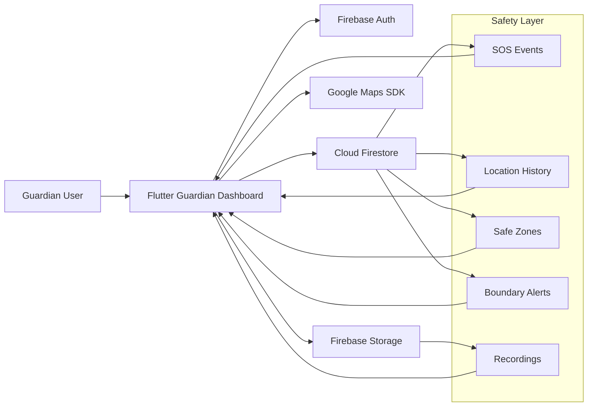
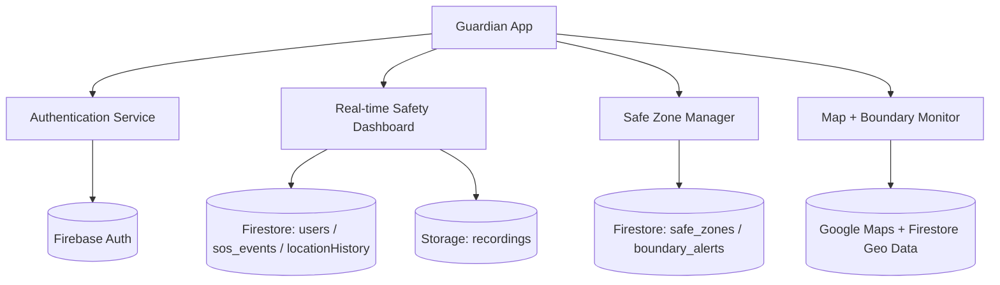
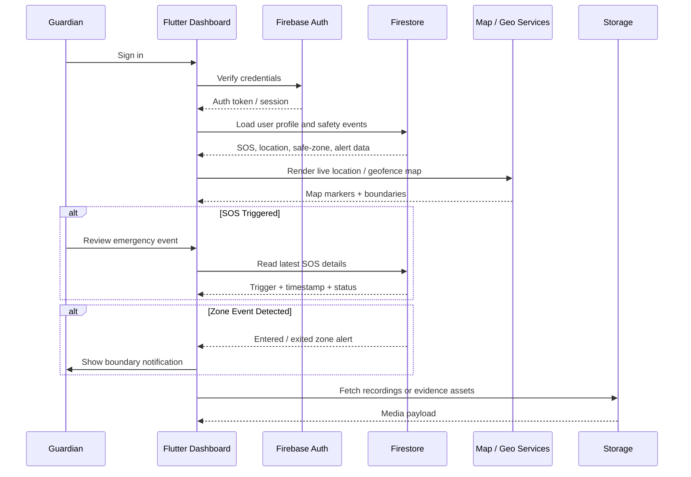
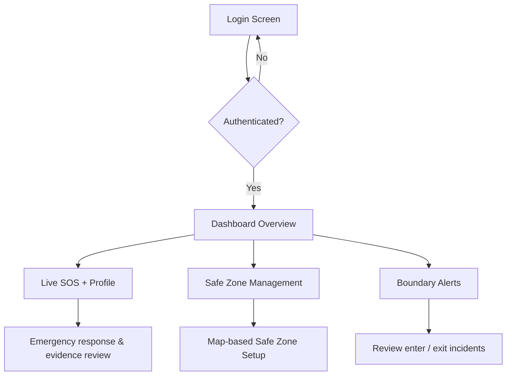

# Shrimati Setu Guardian Dashboard

<p align="center">
  
  
  
  
</p>

<div align="center">
  <h3>Built for guardians who cannot afford delays.</h3>
</div>

<p align="center">
  <b>Shrimati Setu Guardian Dashboard</b> is a high-trust safety intelligence platform designed to help guardians monitor, protect, and respond to a vulnerable person’s location and well-being in real time.
</p>

<p align="center">
  It combines secure authentication, emergency SOS monitoring, geofenced safe-zone awareness, and evidence tracking into a premium command-center experience.
</p>

<p align="center">
  
</p>

---

## Why this project matters

When safety is on the line, every second counts. Guardians need:

- instant SOS awareness
- real-time visibility into movement and location
- geofence alerts for boundaries and safe zones
- a secure decision-making interface
- evidence and activity records for faster action

This dashboard turns those critical signals into a clear, usable control room.

---

## Product vision

The platform acts as the guardian-side command panel for the Shrimati Setu ecosystem:

- monitor user status in real time
- receive SOS and emergency alerts immediately
- validate safe-zone entry and exit events
- manage geofencing boundaries and jurisdiction rules
- review activity history and media evidence

---

## At a glance

<div align="center">

| Capability | Impact |
| --- | --- |
| Real-time Guardian Console | Fast visibility into active safety conditions |
| SOS Event Monitoring | Rapid emergency awareness and response |
| Safe Zone Control | Protects boundaries across trusted locations |
| Boundary Alerting | Detects risky entry and exit activity |
| Evidence Tracking | Supports trust, accountability, and response |

</div>

---

## Core capabilities

### Real-time guardian overview
- secure login for authorized guardians
- live user profile and session state
- dashboard tiles showing safety conditions and activity

### SOS monitoring
- fetch latest SOS trigger from Firestore
- highlight trigger type, timestamp, status, and signal strength of incidents
- support emergency response workflows from a single screen

### Safe zone management
- add, edit, and delete secure locations
- define geofence radius and active safety boundaries
- toggle safe-zone states dynamically
- observe entry and exit alerts in the boundary monitoring panel

### Evidence & tracking
- live location data management
- recordings linked to user activity
- visual boundary status history for better decision-making

---

## Tech stack

- Flutter for cross-platform UI
- Firebase Authentication for guardian access control
- Cloud Firestore for real-time event and data sync
- Firebase Storage for media assets and recordings
- Google Maps Flutter for location visualization
- Google Fonts for premium visual design
- Dart + Material 3 inspired styling for modern dashboard UX

---

## System architecture



### High-level system context



---

## Data flow architecture



---

## Primary data model

| Collection | Purpose | Example fields |
| --- | --- | --- |
| `users` | Guardian / user account metadata | `displayName`, `email`, `photoUrl` |
| `users/{uid}/sos_events` | SOS incidents and emergency events | `time`, `status`, `triggerType`, `lat`, `lng` |
| `locationHistory` | Live geolocation records | `userId`, `lat`, `lng`, `timestamp` |
| `safe_zones` | Geofenced safe areas | `zoneName`, `latitude`, `longitude`, `radius`, `active` |
| `boundary_alerts` | Enter / exit notifications | `zoneId`, `zoneName`, `childId`, `type`, `timestamp` |
| `recordings` | Media evidence related to safety visits or alerts | `userId`, `fileUrl`, `createdAt` |

---

## App flow



---

## Project structure

```text
shrimati_setu_guardian_dashboard/
├── android/                     # Android project files
├── ios/                         # iOS project files
├── lib/
│   ├── main.dart                # App bootstrap and route config
│   ├── firebase_options.dart    # Firebase platform config
│   ├── models/
│   │   ├── safe_zone.dart
│   │   └── boundary_alert.dart
│   ├── screens/
│   │   ├── login_screen.dart
│   │   ├── dashboard_screen.dart
│   │   ├── safe_zone_management_screen.dart
│   │   └── safe_zone_map_screen.dart
│   └── services/
│       └── safe_zone_service.dart
├── test/
│   └── widget_test.dart
├── pubspec.yaml
├── analysis_options.yaml
├── README.md
├── firebase.json
├── index.html
├── netlify.toml
├── tailwind.config.js
├── vite.config.js
├── package.json
└── web/
```

---

## Quick start

### 1. Install Flutter dependencies

```bash
flutter pub get
```

### 2. Set up Firebase

- create a Firebase project
- enable Authentication
- enable Cloud Firestore
- enable Firebase Storage
- generate `firebase_options.dart` and add it to `lib/`

### 3. Run the app

```bash
flutter run
```

For web:

```bash
flutter run -d chrome
```

### 4. Build for production

```bash
flutter build web
```

---

## Design direction

The app uses a premium dark-tech aesthetic with:

- deep space-black backgrounds
- neon pink / violet accent gradients
- glassmorphism panels
- readable, high-contrast text
- real-time response styling for critical incidents

This gives the dashboard the feel of a command center rather than a generic mobile app.

---

## Key design goals

- fast, reliable guardian action
- confidence under pressure
- visual clarity for emergency conditions
- security-first surfaces and authentication flow
- operational transparency through data-rich dashboards

---

## Roadmap

- integrate role-based guardian and child mapping
- live map-based alert drilldowns
- push notifications for emergency triggers
- reporting and audit logs
- AI-assisted safety intelligence and anomaly detection
- richer analytics dashboards for guardian teams

---

## Status

This project is actively shaped as a real-world safety monitoring dashboard for the Shrimati Setu ecosystem. It is designed to be production-minded, scalable, and operationally useful for guardian-driven emergency response.

---

## Maintainer / project intent

The purpose of this app is to make guardians feel informed, protected, and ready to act. It turns raw location and safety data into a visual, actionable safety command center.

If you want, I can also turn this into a more premium GitHub-style README with:

- a custom banner image section
- better badges and shields
- a feature screenshot mockup section
- a more startup-style landing page version
- a version tailored specifically for hackathon/demo presentation
